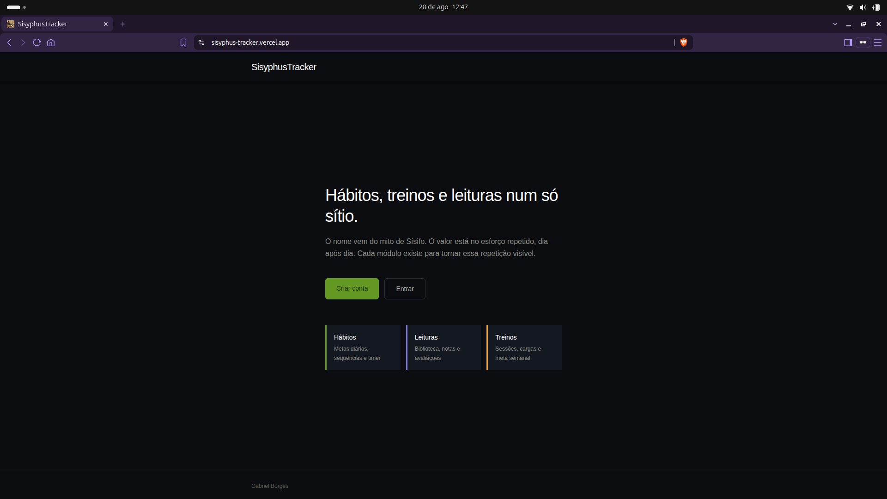
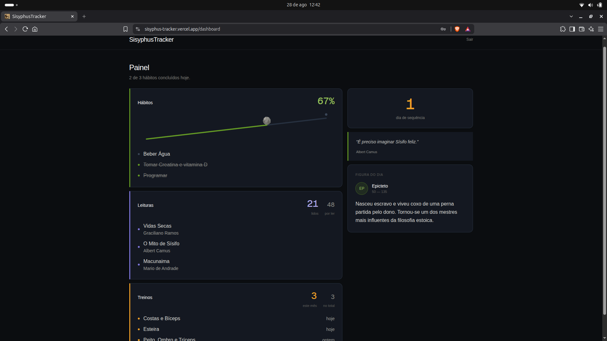
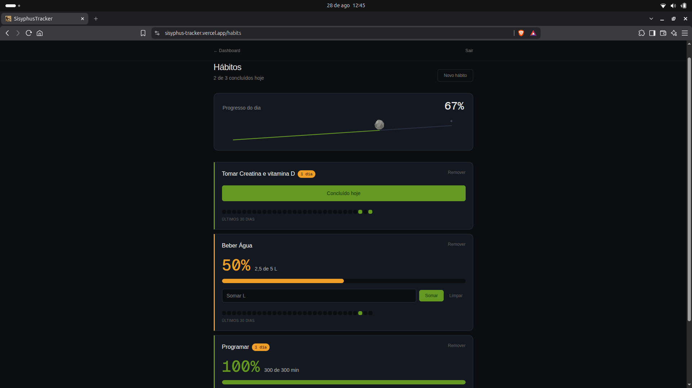
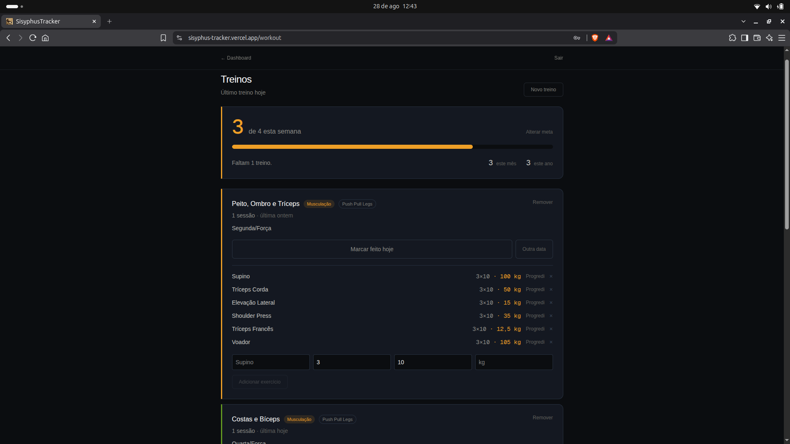
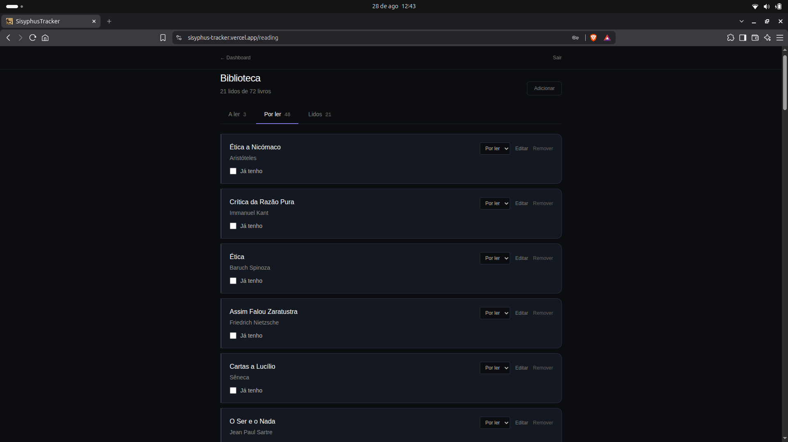

# SisyphusTracker

[](https://github.com/GabrielFBB/sisyphus-tracker/actions/workflows/tests.yml)

Aplicação fullstack de desenvolvimento pessoal que reúne três módulos num só sítio: hábitos diários, treinos e biblioteca de leituras.

O nome vem do mito de Sísifo — a ideia de que o valor está no esforço repetido, dia após dia. Cada módulo existe para tornar essa repetição visível.

**Demo:** [sisyphus-tracker.vercel.app](https://sisyphus-tracker.vercel.app)



## Ecrãs

**Painel** — progresso do dia, hábitos por fazer, livros em curso, últimos treinos, sequência mais longa, citação e figura do dia.



**Hábitos** — três tipos de hábito, barra de progresso, timer para os de duração, sequência de dias e grelha dos últimos 30 dias.



**Treinos** — meta semanal com estado visível, modalidade e método, exercícios com séries, repetições e carga.



**Biblioteca** — três estados, notas de leitura, avaliação com decimais e importação em lote.



## Funcionalidades

**Autenticação** — registo e login com JWT, tokens renovados automaticamente, rotas protegidas no frontend.

**Hábitos** — criar e gerir hábitos diários com registo de conclusão por dia.

**Treinos** — registo de sessões com data, notas e exercícios associados.

**Leituras** — biblioteca com três estados (por ler, a ler, lido), nota de 0 a 10 com decimais, notas de leitura e marcação de livros que já se possui. Inclui importação em lote: cola-se uma lista de texto livre e um parser separa título e autor, deteta duplicados e mostra uma pré-visualização antes de gravar.

**Instalável no telemóvel** — configurado como PWA, pode ser adicionado ao ecrã principal e abre em ecrã cheio, sem barra do browser.

**Frase do dia** — uma citação filosófica diferente por dia no painel principal.

## Stack

| Camada | Tecnologia |
|---|---|
| Frontend | Next.js 16, React 19, TypeScript, Tailwind CSS 4 |
| Backend | Django 6, Django REST Framework, Gunicorn |
| Base de dados | PostgreSQL |
| Autenticação | JWT (SimpleJWT) |
| Containerização | Docker, Docker Compose |
| Deploy | Vercel (frontend), Render (backend), Supabase (base de dados) |

## Arquitetura

```
sisyphus-tracker/
├── backend/
│   ├── core/          # configuração Django, URLs, autenticação
│   ├── habits/        # módulo de hábitos
│   ├── workout/       # módulo de treinos
│   └── reading/       # módulo de leituras
├── frontend/
│   └── app/
│       ├── lib/       # cliente da API e gestão de tokens
│       ├── login/
│       ├── register/
│       ├── dashboard/
│       ├── habits/
│       ├── workout/
│       └── reading/
└── docker-compose.yml
```

O backend expõe uma API REST em `/api/`, com os dados isolados por utilizador em todos os endpoints. O frontend consome essa API e guarda os tokens no browser, renovando o access token automaticamente quando expira.

## Testes

29 testes no backend cobrindo logica de negocio, isolamento de dados por utilizador, autenticacao e restricoes da base de dados.

```bash
docker-compose exec backend pytest -v
```

Um workflow do GitHub Actions corre os testes e compila o frontend a cada push, contra um PostgreSQL real.

## Correr localmente

Requisitos: Docker e Docker Compose.

```bash
git clone https://github.com/GabrielFBB/sisyphus-tracker.git
cd sisyphus-tracker
docker-compose up --build
```

Cria um ficheiro `backend/.env`:

```
DEBUG=True
SECRET_KEY=uma-chave-qualquer-para-desenvolvimento
DB_NAME=sisyphus
DB_USER=sisyphus_user
DB_PASSWORD=sisyphus_pass
DB_HOST=db
DB_PORT=5432
```

E um `frontend/.env.local`:

```
NEXT_PUBLIC_API_URL=http://localhost:8000
```

Aplica as migrações e cria um utilizador administrador:

```bash
docker-compose exec backend python manage.py migrate
docker-compose exec backend python manage.py createsuperuser
```

Frontend em `localhost:3000`, API em `localhost:8000`, admin do Django em `localhost:8000/admin`.

## API

| Método | Endpoint | Descrição |
|---|---|---|
| POST | `/api/register/` | Criar conta |
| POST | `/api/token/` | Login, devolve access e refresh |
| POST | `/api/token/refresh/` | Renovar access token |
| GET, POST | `/api/habits/` | Listar e criar hábitos |
| GET, POST | `/api/workouts/` | Listar e criar treinos |
| GET, POST | `/api/books/` | Listar e criar livros |
| GET, PUT, DELETE | `/api/books/{id}/` | Detalhe, edição e remoção |

Os endpoints de listagem devolvem apenas os registos do utilizador autenticado.

## Autor

Gabriel Borges — [github.com/GabrielFBB](https://github.com/GabrielFBB)
